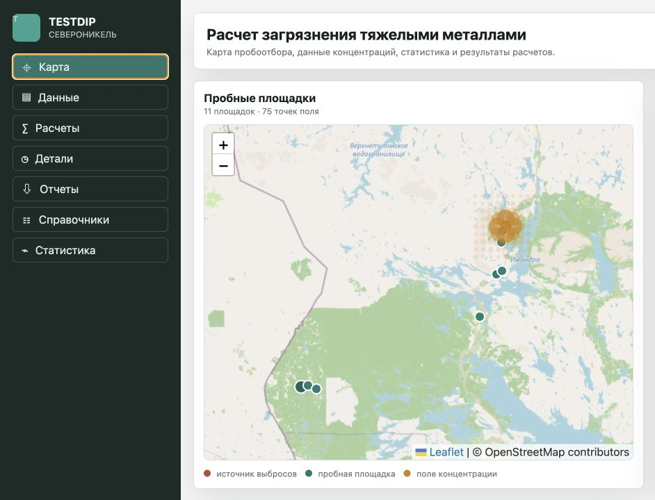
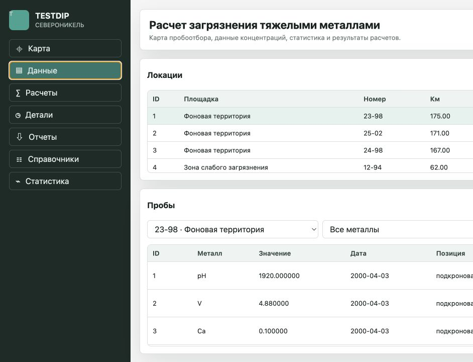
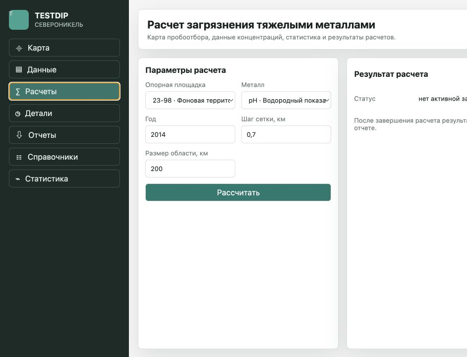
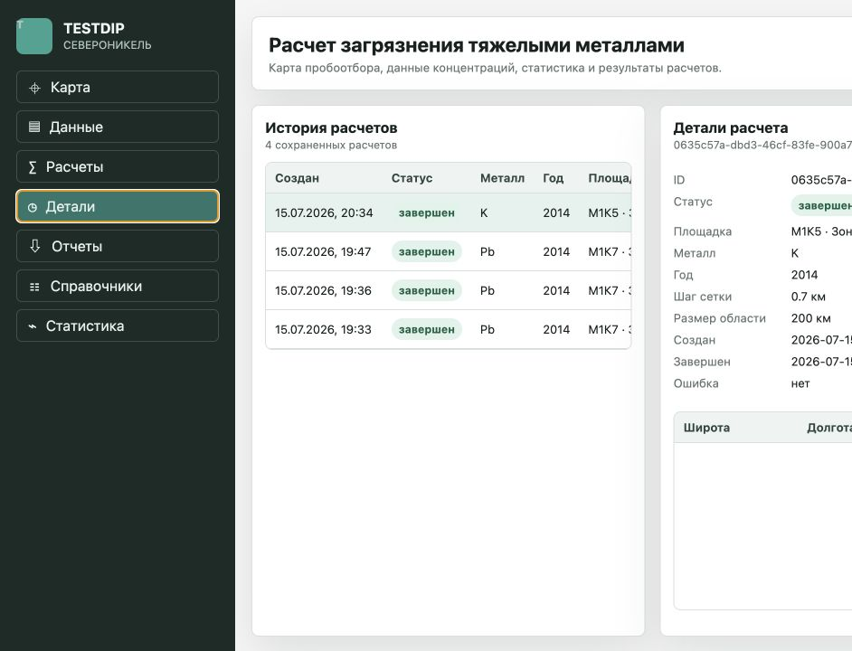
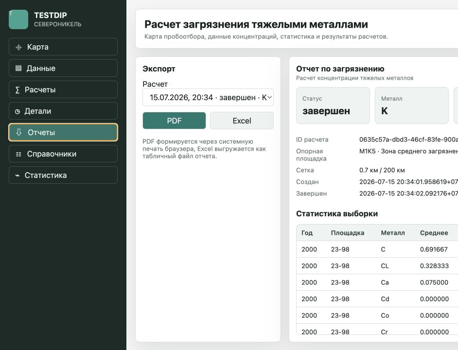
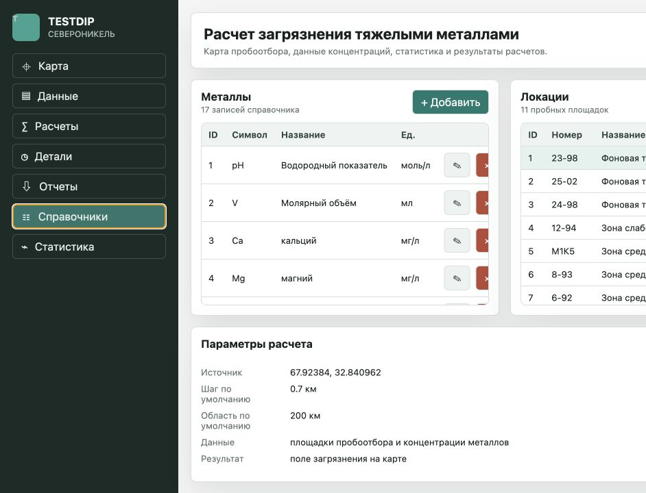

# Интерфейс Пользователя

Документ фиксирует основные экраны web-приложения и показывает, как пользователь работает с системой расчета загрязнения тяжелыми металлами.

## Главный Экран С Картой

После запуска пользователь попадает на карту пробоотбора. На карте отображаются источник выбросов, площадки пробоотбора и рассчитанное поле концентрации. Справа находится панель выбранной площадки с координатами, номером, расстоянием от источника и описанием.

## Экран Данных

Раздел "Данные" предназначен для просмотра площадок и проб. Пользователь выбирает площадку, видит связанные с ней концентрации металлов, применяет фильтры по металлу и году, а также добавляет, изменяет или удаляет записи.

## Экран Расчета

В разделе "Расчеты" пользователь выбирает опорную площадку, металл, год, размер области и шаг сетки. После запуска создается расчетное задание, которое передается на асинхронную обработку.

## Экран Деталей Расчета

Раздел "Детали" показывает историю расчетов, текущий статус выбранного задания и рассчитанные точки сетки. Этот экран нужен для контроля выполнения и просмотра результата после завершения worker-процесса.

## Экран Отчетов

Раздел "Отчеты" используется для подготовки результата к выгрузке. Пользователь может сформировать печатный PDF-отчет или Excel-совместимый файл с расчетными данными.

## Экран Справочников

В разделе "Справочники" вынесены данные, которые используются в разных частях системы: металлы, площадки пробоотбора и параметры расчета. Такой экран упрощает сопровождение исходных данных.

## Сценарий Работы Пользователя

Типовой сценарий выглядит так:

1. Пользователь открывает карту и выбирает площадку пробоотбора.
2. В разделе "Данные" проверяет пробы и при необходимости добавляет новые значения.
3. В разделе "Расчеты" выбирает металл, год и параметры расчетной сетки.
4. Система создает расчетное задание и передает его worker-процессу.
5. Пользователь открывает "Детали" и контролирует статус расчета.
6. После завершения расчетные точки отображаются на карте.
7. В разделе "Отчеты" пользователь выгружает результат.
